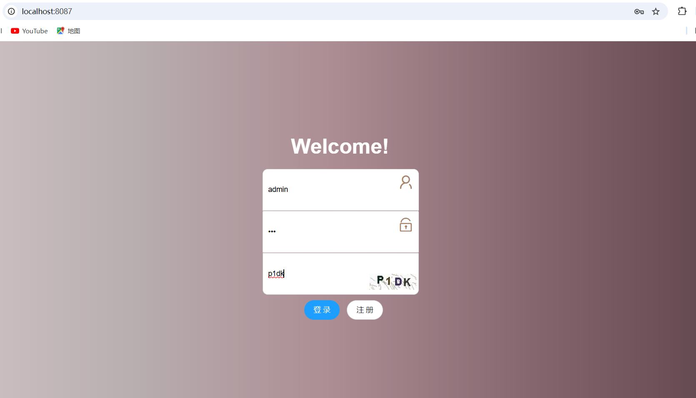
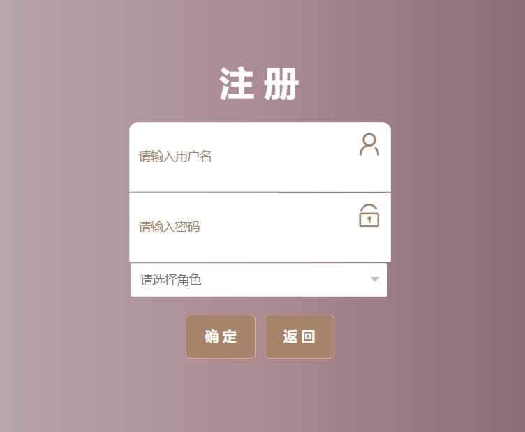
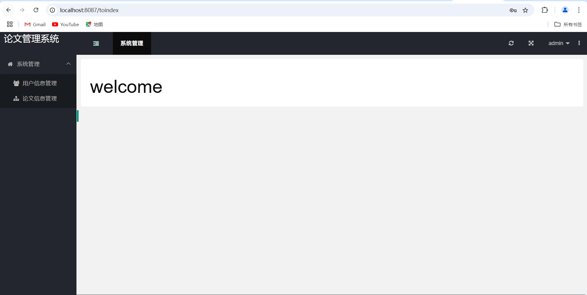
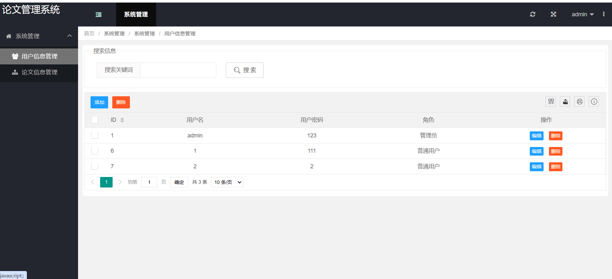
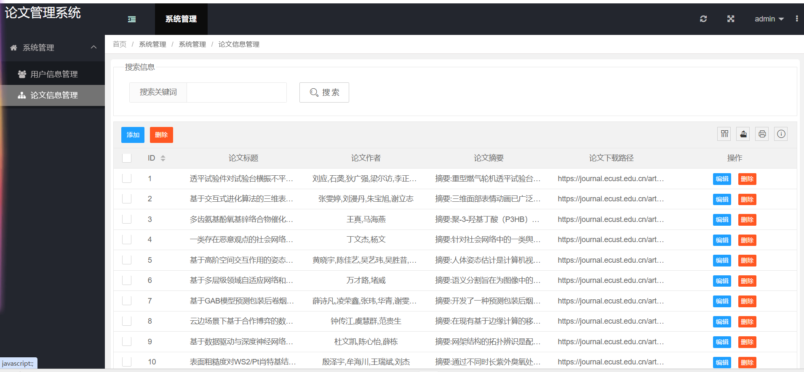
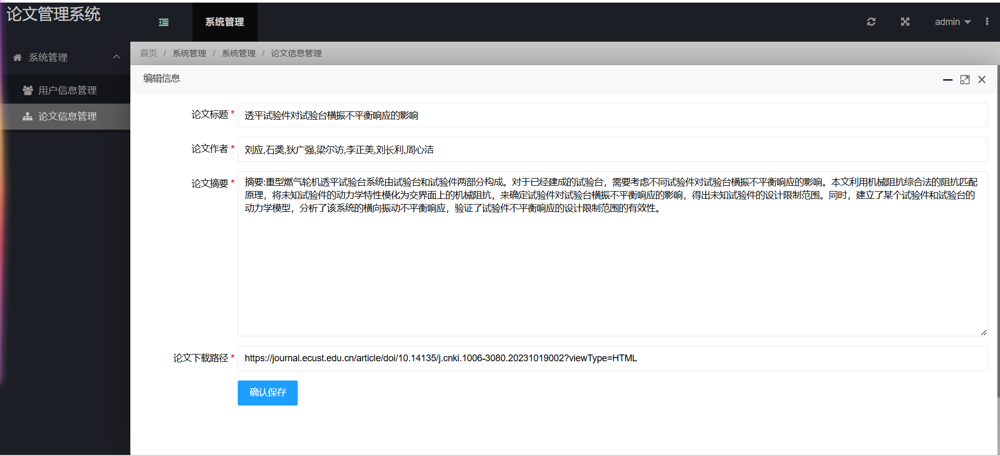
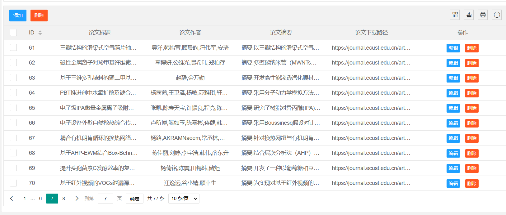
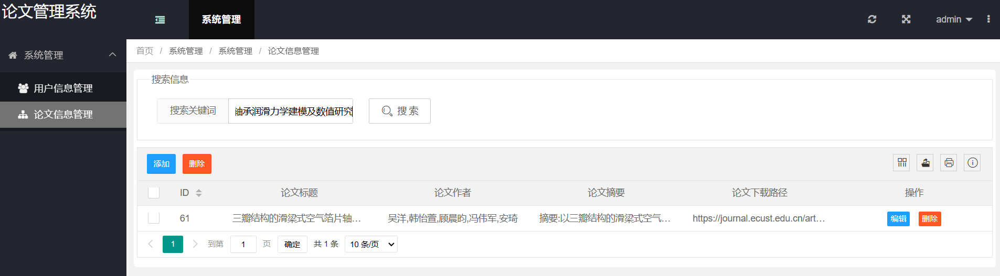
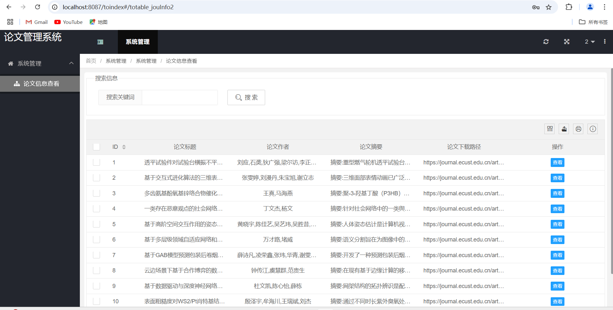
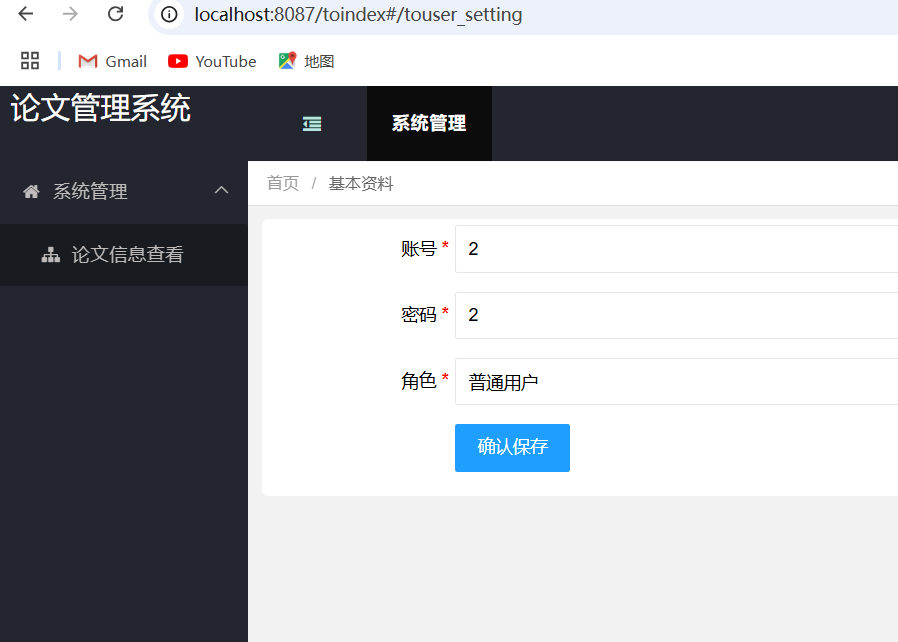

# 项目介绍
本论文管理系统是一个基于 Java 的 Web 应用程序，旨在方便对论文信息的管理与查询操作，主要采用的技术栈如下：
- 后端：采用 Spring Boot 框架进行开发，它提供了便捷的开发方式、强大的自动化配置以及丰富的插件支持，能够快速构建稳定高效的 Web 应用服务。
为了实现对数据库的高效操作，使用了mybatis作为持久层框架，同时在MVC模式下将后端分为了模型、视图和控制器三个层次。
- 前端：主要使用 Layui 框架，其简洁易用、界面美观，能够快速构建出符合需求的用户交互界面，实现数据展示与用户操作的响应。
- 数据爬取：利用 Python Flask 框架编写爬虫程序，实现从华东理工大学学报网站抓取论文相关数据的功能。
- 数据库：选用 phpMyAdmin 作为数据库管理工具，存储爬取到的论文数据以及系统运行过程中产生的其他数据，便于数据的持久化管理与高效查询操作。
# 主要实现功能
用户主要分为两种，普通用户和管理员。
普通用户功能：
- 查看论文
- 搜索感兴趣的论文
  管理员功能：
- 管理普通用户的账号信息
- 管理论文，对论文进行增删改查
# 数据库设计
## jou_info表结构
|字段|id|title|author|abstracts|html_con|
|-|-|-|-|-|-|
|类型|int|longtext|longtext|longtext|longtext|
|解释|序号（主键）|论文标题|论文作者|论文摘要|HTML查看链接|
## users表结构
|字段|user_id|username|password|role|
|-|-|-|-|-|
|类型|int|varchar|varchar|varchar|
|解释|序号（主键）|用户名|密码|角色|
# 演示图

